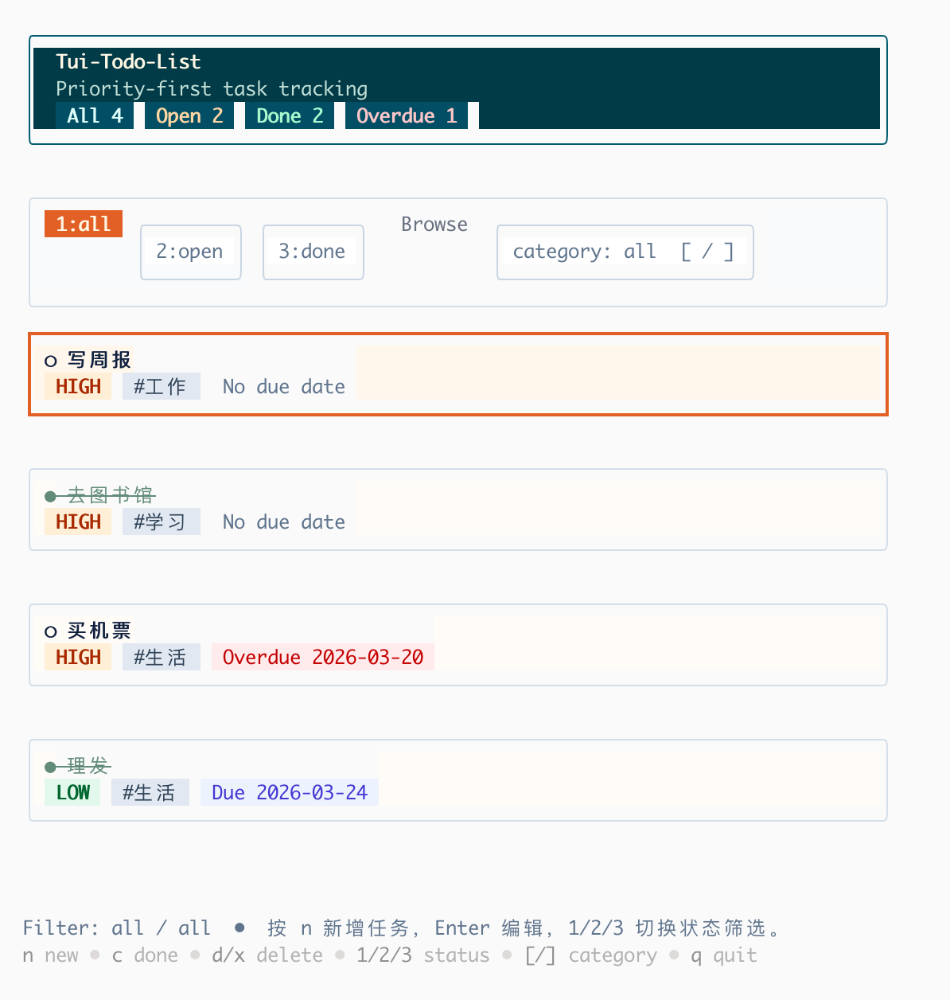

# tui-todo-list

一个用 Go 编写的终端待办事项应用，基于 `Bubble Tea`、`Bubbles` 和 `Lip Gloss` 实现。

它面向键盘操作，支持任务管理、搜索、批量操作、分类筛选和截止日期提醒，适合在终端里快速整理待办事项。

## Screenshot



## Features

- 任务新增、编辑、删除
- 完成状态切换
- 列表内联搜索
- 批量选择、批量完成、批量删除
- 分类筛选
- 状态筛选：`All / Open / Done`
- 优先级：`low / medium / high / urgent`
- 列表按优先级排序，高优先级优先；同优先级按截止日期最近优先
- 截止日期
- 本地 JSON 持久化
- storage 和领域筛选逻辑单元测试
- 终端友好的紧凑布局

## Tech Stack

- Go `1.24.2`
- `github.com/charmbracelet/bubbletea`
- `github.com/charmbracelet/bubbles`
- `github.com/charmbracelet/lipgloss`

## Run

在项目目录执行：

```bash
go run .
```

编译：

```bash
go build ./...
```

构建后的可执行文件名称取决于当前目录名；如果只是本地使用，直接 `go run .` 最省事。

## Data Storage

任务数据默认保存在：

```text
~/.todo-tui.json
```

## Task Model

每个任务包含以下字段：

- `title`
- `category`
- `priority`
- `due_date`
- `completed`

界面包含：

- 列表视图
- 搜索模式
- 表单视图
- 顶部统计条
- 单行筛选栏
- 彩色状态徽标

## Keybindings

### List View

- `n` / `a`: 新建任务
- `enter` / `e`: 编辑当前任务
- `↑/k`: 上移
- `↓/j`: 下移
- `c` / `space`: 切换完成状态
- `d` / `x`: 删除当前任务
- `/`: 打开搜索
- `esc`: 退出搜索
- `v`: 选中 / 取消选中当前任务
- `u`: 清空已选任务
- `C`: 批量切换已选任务完成状态
- `X`: 批量删除已选任务
- `1`: 筛选 `All`
- `2`: 筛选 `Open`
- `3`: 筛选 `Done`
- `[` / `]`: 切换分类筛选
- `?`: 展开帮助
- `q`: 退出

### Form View

- `tab`: 下一个字段
- `shift+tab`: 上一个字段
- `enter`: 确认当前字段；在最后一个字段保存
- `ctrl+s`: 保存
- `esc`: 取消
- `ctrl+d`: 删除当前正在编辑的任务

优先级字段支持：

- `←/h`
- `→/l`
- `↑/k`
- `↓/j`
- `p`

## Project Structure

```text
.
├── main.go
├── README.md
├── assets
│   └── image.png
├── go.mod
├── go.sum
└── internal
    ├── app
    │   ├── domain.go
    │   ├── form.go
    │   ├── keys.go
    │   ├── model.go
    │   ├── run.go
    │   ├── search.go
    │   ├── storage.go
    │   ├── storage_test.go
    │   ├── styles.go
    │   ├── types.go
    │   ├── update_list.go
    │   ├── util.go
    │   └── view.go
    └── domain
        ├── todo.go
        └── todo_test.go
```

## Design Notes

项目已经从单文件实现重构为按职责拆分的结构，目标是避免把所有逻辑堆在一个文件里，并尽量符合常见设计原则：

- 单一职责：视图、更新、存储、领域规则分离
- 高内聚：表单逻辑集中在 `form.go`
- 低耦合：入口只依赖 `app.Run()`
- 可维护性：按 Bubble Tea 的职责拆分 `Update` / `View` / state
- 可测试：领域层和存储层可独立验证

当前职责划分：

- `run.go`: 应用启动和装配
- `types.go`: 基础类型和应用状态
- `keys.go`: 按键映射
- `styles.go`: UI 样式
- `model.go`: Bubble Tea 生命周期入口
- `update_list.go`: 列表页交互
- `form.go`: 表单页交互与保存
- `search.go`: 搜索模式切换与输入初始化
- `view.go`: 所有视图渲染
- `internal/domain/todo.go`: 过滤、搜索、排序、分类、优先级、日期等规则
- `storage.go`: 本地持久化
- `util.go`: 通用辅助方法
- `*_test.go`: 存储和领域逻辑的单元测试

## Limitations

当前版本还有一些可以继续优化的点：

- 任务数据目前只保存在单个本地 JSON 文件中，还没有导入导出或同步能力
- 批量操作以键盘快捷键为主，还没有更显式的可视化操作条
- 排序规则目前固定为“优先级 + 截止日期”，还不支持用户自定义排序策略
- 暂无归档、重复任务、标签体系等更完整的任务管理能力

## Next Steps

如果继续演进，建议优先做：

1. 增加导入 / 导出和备份能力
2. 为批量操作和搜索增加更明确的界面反馈
3. 补充更多领域测试，例如逾期、高亮和边界日期场景
4. 增加标签、归档和自定义排序策略
